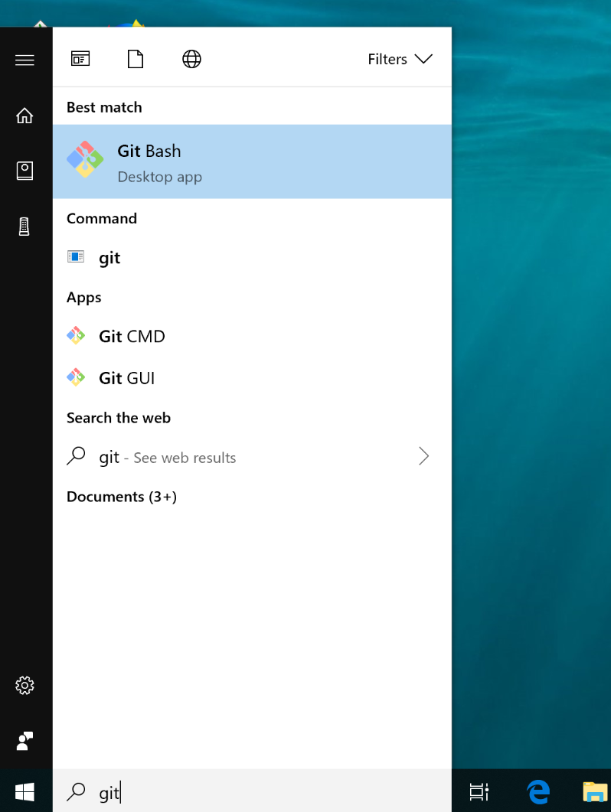

# Table of Contents

1.  [Setup](#org5826409)
    1.  [Git bash cli](#org04995e4)
        1.  [Windows](#org1ba40f8)
        2.  [Mac](#org283b69b)
        3.  [Terminal commands](#orge6c82bf)
2.  [Repositories](#org0746363)
    1.  [Local](#org5fa3136)
    2.  [Remotes](#orga2b4aab)
        1.  [Setting up remote authentication](#org58e3865)
        2.  [mac](#orgadecdf4)
        3.  [Push a local to a new remote](#org8896db8)
        4.  [Fork](#org1b3636f)
        5.  [Cloning](#orgb06b157)

# Setup

## Git bash cli

We will rely on the command line interface (CLI) to work with git. While this may
seem arcane at first, relative to a more famililar point-and-click interface,
using the command line will have major payoffs for the initial investment. The
key benefits of the cli over a graphical client are:

-   efficiency
-   flexibility
-   portability

We are going to use git-bash as our CLI client on Windows. We then will setup a cli
for Mac after configuring Windows. 

### Windows

1.  Configuration

    We follow instructions from the
    [Git book](https://git-scm.com/book/en/v2/Getting-Started-First-Time-Git-Setup)
    
    1.  Start git bash
    
        
        
        This should open up the console with a git bash shell:
        
        
    
    2.  git user config file is:
    
        `C:\Users\$USER\.gitconfig`
        
        where `$USER` is the user name (i.e., serge)
    
    3.  In git bash:
    
            serge@DESKTOP-FA80SDI MINGW64 ~
            $ cat .gitconfig
            [user]
                    name = Serge Rey
                    email = sjsrey@gmail.com
        
        This was after I setup my config with:
        
            $ git config --global user.name "Serge Rey"
            $ git config --global user.email sjsrey@gmail.com
    
    4.  Editor: Notepad ++
    
        [download and install 32-bit version](https://notepad-plus-plus.org/)
        used only for git commit messages
        
        Setup for git commit messages:
        
            git config --global core.editor "'C:/Program Files (x86)/Notepad++/notepad++.exe' -multiInst -nosession"
        
        After this check, check your settings:
        
            $ pwd
            /c/Users/serge/
            
            serge@DESKTOP-FA80SDI MINGW64 ~
            $ cat .gitconfig
            [user]
                    name = Serge Rey
                    email = sjsrey@gmail.com
            [core]
                    editor = 'C:/Program Files (x86)/Notepad++/notepad++.exe' -multiInst -nosession
            
            serge@DESKTOP-FA80SDI MINGW64 ~
        
        Or use git itself to check specific settings:
        
            serge@DESKTOP-FA80SDI MINGW64 ~
            $ git config user.name
            Serge Rey
            
            serge@DESKTOP-FA80SDI MINGW64 ~
            $ git config user.email
            sjsrey@gmail.com

### Mac

1.  Configuration

### Terminal commands

Once we have the command line client setup, we are at a bash prompt on either
Windows or Mac, and the commands will all be the same (with the exception of
the editor if we are using one to create the git commit messages-more below).

Some common bash commands to become familiar with include:

1.  finding out current directory: `pwd`

        serge@DESKTOP-FA80SDI MINGW64 ~
        $ pwd
        /c/Users/serge/
        
        serge@DESKTOP-FA80SDI MINGW64 ~

2.  listing contents of current director: `ls`

        serge@DESKTOP-FA80SDI MINGW64 ~
        $ ls
        '3D Objects'/
         Anaconda3/
         AppData/
        'Application Data'@
         Contacts/
         Cookies@
         Desktop/
         Documents/
         Downloads/
         Dropbox/
         Favorites/
         Links/
        'Local Settings'@
         MicrosoftEdgeBackups/
         Music/
        'My Documents'@
         NetHood@

3.  moving to a directory: `cd`

        serge@DESKTOP-FA80SDI MINGW64 ~
        $ cd Documents/
        
        serge@DESKTOP-FA80SDI MINGW64 /c/Users/serge/Documents
        $ pwd
        /c/Users/serge/Documents
        
        serge@DESKTOP-FA80SDI MINGW64 /c/Users/serge/Documents
    
    Note that `cd` without an argument will take you back to your home directory.
    
    Also note that `clear` will clear the terminal.

4.  making a directory: `mkdir`

# Repositories

## Local

-   create a local repository
-   git init
-   edit a file README.md
-   git status
-   demonstrate git add
-   demonstrate git commit
-   using the editor
-   git status
-   

-   fire up spyder
-   create a file saving to the same directory as the repository
-   git status
-   edit in spyder to develop
-   git bash for interfacing with git

## Remotes

### Setting up remote authentication

[ssh keys](https://git-scm.com/book/en/v2/Git-on-the-Server-Generating-Your-SSH-Public-Key#_generate_ssh_key)

[auto launching agent on git bash](https://help.github.com/en/articles/working-with-ssh-key-passphrases#auto-launching-ssh-agent-on-git-for-windows)

### mac

[agent](https://help.github.com/en/articles/generating-a-new-ssh-key-and-adding-it-to-the-ssh-agent#adding-your-ssh-key-to-the-ssh-agent)

### Push a local to a new remote

-   create a remote on github
-   see instructions about pushing a local repositor
-   cut and paste instructions
-   git remote -v
-   git push -u origin master
-   checkout remote repos
-   

-   make a change on the web site
-   git status

### Fork

### Cloning

