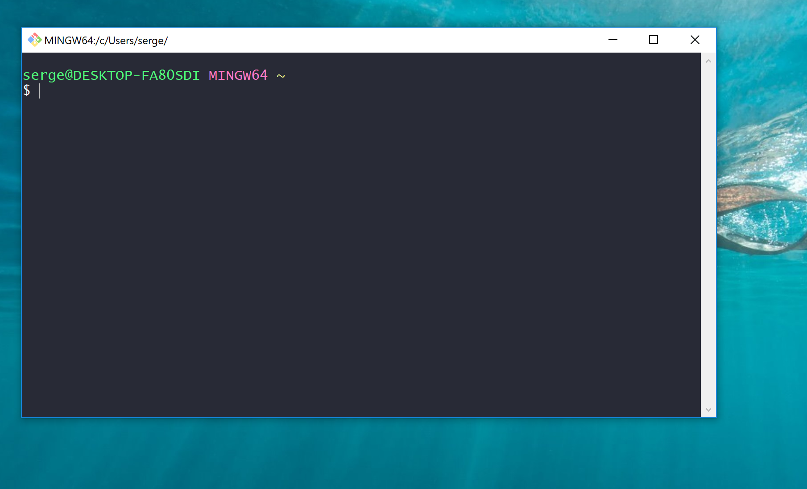

# Table of Contents

1.  [Setup](#orgf90f2ed)
    1.  [Git cli](#org57a8718)
        1.  [Windows](#org291c08d)
        2.  [Mac](#orgfcdd7af)
        3.  [Terminal commands](#org6047343)
2.  [Repositories](#orgf9ece02)
    1.  [Local](#orgccb27c8)
    2.  [Remotes](#org412e1fb)
        1.  [Setting up remote authentication](#orgd247ab5)
        2.  [mac](#org8e65bb7)
        3.  [Push a local to a new remote](#orgd002f17)
        4.  [Fork](#org80c148b)
        5.  [Cloning](#org1f91108)

# Setup

## Git cli

### Windows

1.  Configuration

    We follow instructions from the
    [Git book](https://git-scm.com/book/en/v2/Getting-Started-First-Time-Git-Setup)
    
    1.  Start git bash
    
        
        
        This should open up the console with a git bash shell:
        
        
    
    2.  git user config file is:
    
        `C:\Users\$USER\.gitconfig`
        
        where `$USER` is the user name (i.e., serge)
    
    3.  In git bash:
    
            serge@DESKTOP-FA80SDI MINGW64 ~
            $ cat .gitconfig
            [user]
                    name = Serge Rey
                    email = sjsrey@gmail.com
        
        This was after I setup my config with:
        
            $ git config --global user.name "Serge Rey"
            $ git config --global user.email sjsrey@gmail.com
    
    4.  Editor: Notepad ++
    
        [download and install 32-bit version](https://notepad-plus-plus.org/)
        used only for git commit messages
        
        Setup for git commit messages:
        
            git config --global core.editor "'C:/Program Files (x86)/Notepad++/notepad++.exe' -multiInst -nosession"
        
        After this check, check your settings:
        
            #$ pwd /c/Users/serge/
            
            serge@DESKTOP-FA80SDI MINGW64 ~
            $ cat .gitconfig
            [user]
                    name = Serge Rey
                    email = sjsrey@gmail.com
            [core]
                    editor = 'C:/Program Files (x86)/Notepad++/notepad++.exe' -multiInst -nosession
            
            serge@DESKTOP-FA80SDI MINGW64 ~
        
        Or use git itself to check specific settings:
        
            serge@DESKTOP-FA80SDI MINGW64 ~
            $ git config user.name
            Serge Rey
            
            serge@DESKTOP-FA80SDI MINGW64 ~
            $ git config user.email
            sjsrey@gmail.com

### Mac

### Terminal commands

1.  cd

2.  ls

3.  mkdir

# Repositories

## Local

-   create a local repository
-   git init
-   edit a file README.md
-   git status
-   demonstrate git add
-   demonstrate git commit
-   using the editor
-   git status
-   

-   fire up spyder
-   create a file saving to the same directory as the repository
-   git status
-   edit in spyder to develop
-   git bash for interfacing with git

## Remotes

### Setting up remote authentication

[ssh keys](https://git-scm.com/book/en/v2/Git-on-the-Server-Generating-Your-SSH-Public-Key#_generate_ssh_key)

[auto launching agent on git bash](https://help.github.com/en/articles/working-with-ssh-key-passphrases#auto-launching-ssh-agent-on-git-for-windows)

### mac

[agent](https://help.github.com/en/articles/generating-a-new-ssh-key-and-adding-it-to-the-ssh-agent#adding-your-ssh-key-to-the-ssh-agent)

### Push a local to a new remote

-   create a remote on github
-   see instructions about pushing a local repositor
-   cut and paste instructions
-   git remote -v
-   git push -u origin master
-   checkout remote repos
-   

-   make a change on the web site
-   git status

### Fork

### Cloning

